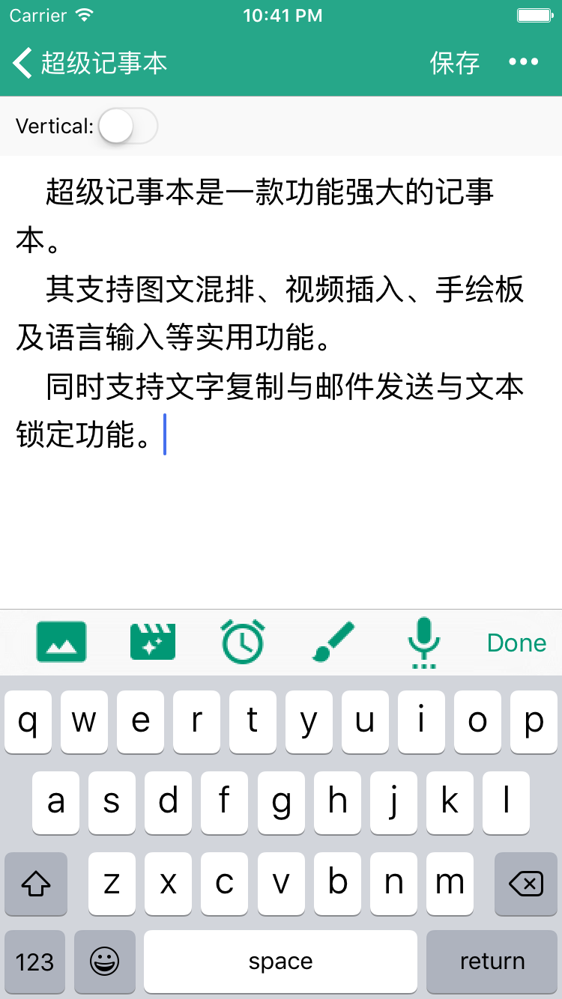
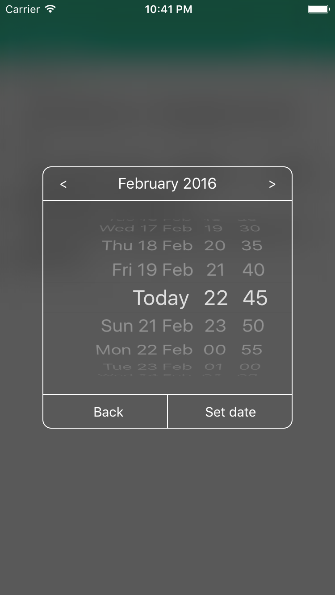
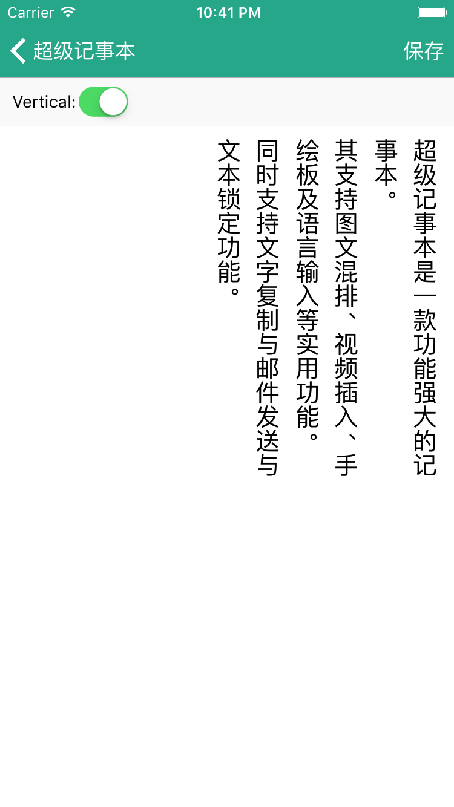
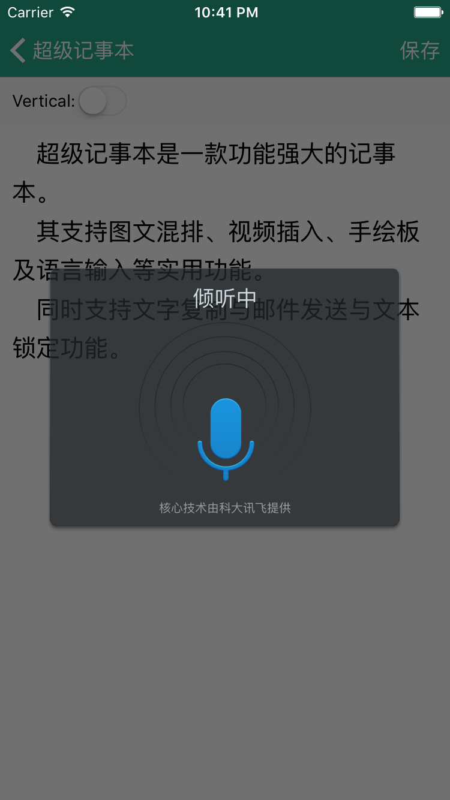
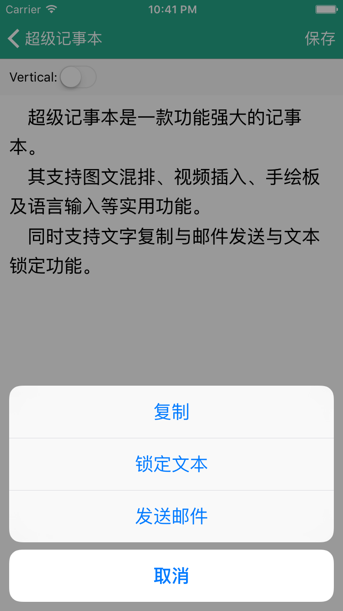

超级记事本
=========

>**超级记事本** - 一款功能强大的笔记应用。

## Update Log - 更新日志

### 2.1.0

- 修复 - 无法正确删除笔记
- 更新 - README

## Screenshots - 预览

  

  

  

  

## Installation - 安装

依赖于 CocoaPods，执行以下命令，下载相关依赖：

    /:> pod install
    
    
## Thanks - 感谢

- 灵感来源: [懒人笔记](https://github.com/liaojinxing/Voice2Note)

## Contact - 联系我

- Weibo：[汤奇V](http://weibo.com/qiktang)
- Blog: [http://itangqi.me](http://itangqi.me)
- Gmail：[imtangqi#gmail.com](mailto:imtangqi@gmail.com "欢迎与我联系")

## License - 许可协议

MIT

